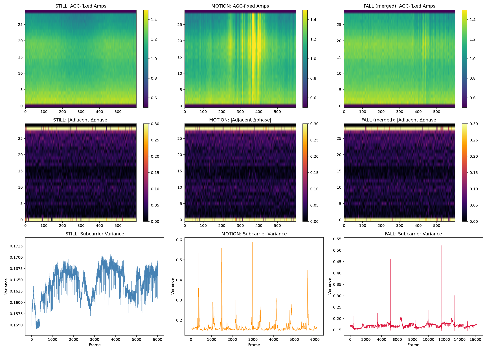

# ESP32-CSI Fall Detection 🚨

> 基于 Wi-Fi CSI（信道状态信息）的跌倒检测系统，使用两块 ESP32-S3 实现实时边缘推理，通过 WS2812B RGB LED 反馈状态，UDP 上报云端。

[](https://github.com/espressif/esp-idf)
[](https://www.python.org/)
[](LICENSE)

---

## 📷 效果展示

| 状态 | LED | 含义 |
|------|-----|------|
| 🟢 绿灯常亮 | — | 静止监测中 |
| 🟠 橙灯慢闪 (1Hz) | — | 检测到运动 |
| 🔴 红灯常亮 | — | 疑似跌倒（等待确认） |
| 🔴 红灯快闪 (4Hz) | — | 跌倒确认 → 自动上报云端 |

> 确认延迟：跌倒后约 **5.5 秒**（2.5s 后置静默 + 3s 二次确认）

---

## 🏗️ 系统架构

```
┌──────────────┐         UDP 发包 (~100Hz)          ┌──────────────────────┐
│  发送板 (TX)  │ ─────────────────────────────────> │   接收板 (RX)         │
│  ESP32-S3     │        Wi-Fi AP-STA 链路           │   ESP32-S3 (APSTA)    │
│  纯发包机      │                                   │                        │
└──────────────┘                                    │ ┌──────────────────┐ │
                                                     │ │ CSI 解析          │ │
                                                     │ │   ↓               │ │
                                                     │ │ AGC 归一化        │ │
                                                     │ │   ↓               │ │
                                                     │ │ 子载波方差         │ │
                                                     │ │   ↓               │ │
                                                     │ │ 滑窗 + 阈值判定    │ │
                                                     │ │   ↓               │ │
                                                     │ │ WS2812B RGB LED   │ │
                                                     │ │   ↓               │ │
                                                     │ │ UDP → 云端上报     │ │
                                                     │ └──────────────────┘ │
                                                     └──────────────────────┘
                                                                │
                                                        UDP :9000
                                                                │
                                                     ┌──────────┴──────────┐
                                                     │   云端服务器          │
                                                     │   udp_ingest.py      │
                                                     │   → JSONL 日志        │
                                                     │   → Web 管理面板      │
                                                     └──────────────────────┘
```

---

## ⚡ ESP32-S3 CSI 的硬件局限

本系统基于 ESP32-S3 内置 Wi-Fi 芯片采集 CSI，但这颗低成本 IoT 芯片在信道测量方面有三项不可回避的硬件限制：

| 局限 | 说明 | 对本系统的影响 |
|------|------|---------------|
| **AGC（自动增益控制）** | μs 级实时调节接收增益，人体摔倒造成的信号功率突变被 AGC 快速补偿 | 摔倒冲击的振幅尖峰被"压扁"，与走路波动的振幅差异远小于真实物理变化 |
| **int8 量化精度** | I/Q 采样仅为 8-bit（-128 ~ 127），动态范围仅 256 级 | 走路和摔倒的信号都已触及量化天花板，区分度不足 |
| **晶振相位噪声** | ESP32-S3 使用 ±25ppm 低成本晶振，2.4GHz 载波漂移可达 ±60kHz | 相邻帧相位差被 CFO 淹没（~0.5-3 rad），无法利用相位/多普勒信息 |

> 以上局限使得本系统只能依赖**子载波间相对幅度形状**（频率选择性衰落）作为特征，而非更丰富的相位、多普勒速度谱等物理量。若使用软件无线电（SDR）等专业设备，理论上可获得 12-bit+ 精度、可关闭 AGC、GPSDO 锁定时钟，跌倒检测性能有望提升一个量级。

---

## 🔬 算法原理

### 1. 单帧特征提取

```
128 字节 CSI → 64 子载波 (I, Q) → 振幅 A = √(I²+Q²)
    → AGC 归一化: A' = A / mean(A)
    → 子载波间方差: var = Σ(A'_i - 1.0)² / 64
```

**物理意义：** 子载波方差反映当前帧的频率选择性衰落程度。人体静止时多径稳定，方差极小；动作时不同子载波受到不同程度的遮挡/反射，方差增大。

### 2. 滑动窗口 + 三条件阈值判定

```
条件 1: 尖峰前连续静默 ≥ 29 窗 (≈2.5s)
  AND
条件 2: 尖峰密度 ≤ 8 窗（排除持续运动）
  AND
条件 3: 尖峰后连续静默 ≥ 29 窗 (≈2.5s)
  ↓
疑似跌倒 → 3s 内若有运动则取消 → 3s 内持续静默则确认
```

### 3. 为什么不用机器学习部署到 ESP32？

- ✅ **规则版**：几次浮点比较 + 计数器，几十行 C 代码，RAM < 10KB
- ❌ CNN/SVM：RBF 核矩阵 + 浮点量化，数百 KB 模型，推理延迟 100ms+

**PC 端对比方案：** AGC 方差曲线 → 1D-CNN，3-fold CV 准确率 96%（详见 `tools/train_cnn.py`）

### 4. 数据来源说明

本项目的训练与测试数据均在**作者寝室环境**中采集，包含 3 类场景共 16 条记录：

| 类别 | 数量 | 单条时长 | 说明 |
|------|------|---------|------|
| 静止（still） | 1 条 | 60s | 无人活动 |
| 运动（motion） | 1 条 | 60s | 自然走动 |
| 跌倒（fall） | 10 条 | ~16s | 站立 → 摔倒 → 躺平 |
| 测试（test） | 4 条 | 60s/16s | 混合场景验证 |

> 完整信号处理可视化（AGC 修正、CFO/SFO 修正、三类别对比）见 `data/full_pipeline.png`：



> **上图说明：** 即使经过 AGC 修正和 CFO/SFO 相位补偿，三类场景（静止、运动、跌倒）的相位信息仍然高度重叠，无法作为有效分类依据。该图直观展示了——在 ESP32-S3 的硬件条件下，企图通过相位分析、子载波相关性等高阶方法提升分类精度是不现实的；唯一稳定可用的特征是子载波间幅度方差。**图及所有分析结果仅在作者寝室 Wi-Fi 环境下有效，不同房间的多径结构不同，阈值需重新标定。**

---

## 📦 硬件清单

| 组件 | 数量 | 说明 |
|------|------|------|
| ESP32-S3 开发板 | 2 | 一块发送，一块接收 |
| WS2812B RGB LED | 1 | 状态指示（接收板 GPIO48） |

**接线（接收板 → WS2812B）：**

```
ESP32-S3 GPIO48 ──[470Ω]──→ WS2812B DI
ESP32-S3 5V     ──────────→ WS2812B VDD
ESP32-S3 GND    ──────────→ WS2812B GND
```

---

## 🚀 快速开始

### 1. 环境准备

- [ESP-IDF v5.3.4](https://docs.espressif.com/projects/esp-idf/en/v5.3.4/)
- Python 3.11+（`pip install pyserial numpy matplotlib torch scikit-learn`）
- 两块 ESP32-S3 开发板

### 2. 刷写发送板

发送板需单独配置为固定 MCS0 发包——建议使用 ESP-IDF 的 `wifi_esptech` 示例或保持 ESP-NOW 广播模式。

### 3. 配置接收板

编辑 `main/app_main.c`：

```c
#define WIFI_STA_SSID     "your_hotspot"    // 手机热点名称
#define WIFI_STA_PASS     "your_password"   // 手机热点密码
#define UDP_SERVER_IP     "your.server.ip"  // 云端服务器 IP
```

### 4. 编译烧录

```bash
cd csi_recv
idf.py set-target esp32s3
idf.py build
idf.py flash monitor
```

### 5. 服务端

```bash
python server/udp_ingest.py --port 9000 --out events.jsonl --print
```

---

## 🔧 功能开关

`main/app_main.c` 顶部：

```c
#define CSI_RAW_DUMP_MODE    1   // 1=串口输出原始 CSI, 0=仅推理
#define FALL_DETECT_ENABLE   1   // 1=启用跌倒检测 + LED + 上报
```

- 两者可同时开启——串口采集数据的同时进行跌倒检测
- 关闭 `FALL_DETECT_ENABLE` 可设为纯数据采集模式

---

## 📁 项目结构

```
csi_recv/
├── main/                        # ESP32 固件
│   ├── app_main.c               # 主程序：WiFi/CSI/UDP/事件回调
│   ├── fall_detect.h            # 跌倒检测接口
│   ├── fall_detect.c            # 检测算法 + WS2812 LED
│   └── CMakeLists.txt
├── tools/                       # Python 工具脚本
│   ├── threshold_detect_v3.py   # 离线阈值检测（验证算法）
│   ├── serial_capture.py        # COM 口采集 CSI 数据
│   ├── train_cnn.py             # 1D-CNN 训练（PC 端对比方案）
│   ├── full_pipeline.py         # 完整可视化（AGC+CFO/SFO）
│   └── plot_one.py              # 单文件快速可视化
├── server/
│   └── udp_ingest.py            # 服务端 UDP → JSONL 采集
├── data/                        # 训练数据（12 条）
├── test/                        # 测试数据（4 条）
├── models/
│   └── fall_cnn_v2.pth          # CNN v2 模型（96% 准确率）
└── README.md
```

---

## 📊 离线验证结果

| 测试 | 描述 | 结果 |
|------|------|------|
| test_1 | 静止 60s | ✅ 无触发 |
| test_2 | 持续走路 60s | ✅ 运动忽略 |
| test_3 | 静止→摔倒→躺平 | ✅ 跌倒检出（SPIKE 1.11× → FALL CONFIRMED） |
| test_4 | 走路→停下 | ✅ 运动中停下，未误报 |

---

## 🌐 云端上报格式

### 心跳（每 60s）

```json
{
    "type": "hb",
    "mac": "aa:bb:cc:dd:ee:ff",
    "count": 42,
    "uptime_ms": 2520000
}
```

### 跌倒事件（仅确认时）

```json
{
    "type": "csi_evt",
    "mac": "aa:bb:cc:dd:ee:ff",
    "note": "fall"
}
```

---

## ⚠️ 已知局限

| 场景 | 状态 |
|------|------|
| 静止 → 跌倒 → 躺平 | ✅ 可靠检出 |
| 走路 → 停下 | ✅ 不误报 |
| **走路 → 跌倒** | ❌ 漏检（运动方差掩盖冲击） |
| 快速蹲下再站起 | ⚠️ 可能误报（阈值可调） |

---

## 📄 参考资料

- [ESP32-CSI Tool](https://github.com/StevenMHernandez/ESP32-CSI-Tool)
- [WiFi Sensing with Channel State Information: A Survey](https://doi.org/10.1145/3310193)
- [ESP-IDF Programming Guide](https://docs.espressif.com/projects/esp-idf/en/stable/)

---

## 📝 License

MIT © 2025

