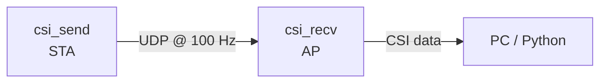

# csi_send — ESP32 CSI Sensing Transmitter

UDP packet sender for CSI-based human activity detection. This firmware runs on the **transmitter** board, sending high-frequency UDP packets to the [csi_recv](../csi_recv) receiver, which extracts Channel State Information (CSI) from the received Wi-Fi frames.

## How It Works



- csi_send connects to the Wi-Fi AP hosted by csi_recv（SSID: `csi_recv`）
- Once connected, it sends a steady 100 Hz stream of UDP packets
- csi_recv captures CSI from these frames for signal analysis / human sensing

## Hardware

| Item | Recommendation |
|------|---------------|
| Chip | ESP32-S3（also works on ESP32-C3/C5/C6） |
| Antenna | External antenna preferred（PCB antenna has poor directivity） |
| Distance | Keep > 1 meter between sender and receiver |

## Quick Start

```bash
cd csi_send
idf.py set-target esp32s3
idf.py build
idf.py flash -b 921600 -p /dev/ttyUSB0 monitor
```

## Configuration

All key parameters are defined at the top of `main/app_main.c`:

| Parameter | Default | Description |
|-----------|---------|-------------|
| `WIFI_SSID` | `csi_recv` | AP name of the receiver |
| `WIFI_PASS` | `12345678` | AP password |
| `UDP_DEST_IP` | `192.168.4.1` | Receiver's IP（csi_recv AP default gateway） |
| `UDP_DEST_PORT` | `5555` | Destination UDP port |
| `SEND_HZ` | `100` | Packet send rate（Hz） |
| `PAYLOAD_SIZE` | `200` | Payload size per packet（bytes） |

## Key Optimizations

### Fixed TX Rate（MCS0）

```c
esp_wifi_config_80211_tx_rate(ESP_IF_WIFI_STA, WIFI_PHY_RATE_MCS0_LGI);
```

Wi-Fi rate adaptation can cause MCS switching between frames, leading to AGC re-tuning on the receiver side — this produces large CSI amplitude jumps (~12 ↔ ~30) that drown out the subtle human motion signal (~2–5 units). Fixing the TX rate to MCS0 eliminates this artifact.

### ENOMEM Backoff

When the TX buffer is full（`sendto` returns `ENOMEM`）, the firmware inserts a brief pause to let the Wi-Fi stack drain, preventing packet loss under congestion.

### sdkconfig Tunings

- `CONFIG_ESP_WIFI_CSI_ENABLED=y` — required for CSI capture on the receiver
- `CONFIG_ESP_WIFI_DYNAMIC_TX_BUFFER_NUM=256` — enlarged TX buffer pool
- `CONFIG_ESP_WIFI_AMPDU_TX_ENABLED=n` — disable AMPDU to keep frame timing predictable
- `CONFIG_FREERTOS_HZ=1000` — 1 ms tick for precise `vTaskDelayUntil` scheduling
- lwIP socket/mbox tuning to reduce `ENOMEM` occurrences

## Project Structure

```
csi_send/
├── CMakeLists.txt          # Project CMake
├── sdkconfig.defaults       # IDF config overrides
├── main/
│   ├── CMakeLists.txt
│   ├── idf_component.yml
│   └── app_main.c           # Main application logic
└── README.md
```

## Requirements

- ESP-IDF ≥ 5.5.0
- Target: `esp32s3`（or `esp32c3` / `esp32c5` / `esp32c6`）

## Related Projects

- [csi_recv](../csi_recv) — CSI receiver with AP mode
- [tools](../csi_recv/tools) — Python data parsing & visualization scripts

## License

MIT

