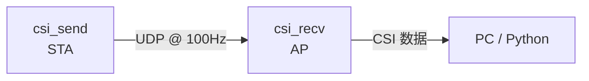

# csi_send — CSI 发送板固件

基于 Wi-Fi CSI 的人体感知系统发送端。本固件运行在**发送板**上，以固定速率向 [csi_recv](../csi_recv) 接收板发送 UDP 数据包，接收板从收到的 Wi-Fi 帧中提取信道状态信息（CSI）。

## 工作原理



- csi_send 连接接收板自建的 Wi-Fi AP（SSID: `csi_recv`）
- 连接成功后，以 100Hz 固定频率持续发送 UDP 数据包
- csi_recv 从这些帧中提取 CSI，用于信号分析 / 人体感知

## 硬件要求

| 项目 | 建议 |
|------|------|
| 芯片 | ESP32-S3（也支持 ESP32-C3/C5/C6） |
| 天线 | 推荐外置天线（PCB 天线方向性差） |
| 距离 | 发送板与接收板保持 1 米以上 |

## 快速开始

```bash
cd csi_send
idf.py set-target esp32s3
idf.py build
idf.py flash -b 921600 -p /dev/ttyUSB0 monitor
```

## 配置参数

所有关键参数在 `main/app_main.c` 顶部定义：

| 参数 | 默认值 | 说明 |
|------|--------|------|
| `WIFI_SSID` | `csi_recv` | 接收板的 AP 名称 |
| `WIFI_PASS` | `12345678` | AP 密码 |
| `UDP_DEST_IP` | `192.168.4.1` | 接收板 IP（csi_recv AP 默认网关） |
| `UDP_DEST_PORT` | `5555` | 目标 UDP 端口 |
| `SEND_HZ` | `100` | 发包频率（Hz） |
| `PAYLOAD_SIZE` | `200` | 每包负载大小（字节） |

## 关键优化

### 固定发送速率（MCS0）

```c
esp_wifi_config_80211_tx_rate(ESP_IF_WIFI_STA, WIFI_PHY_RATE_MCS0_LGI);
```

Wi-Fi 速率自适应会导致帧间 MCS 切换，触发接收端 AGC 重新调校——这会产生剧烈的 CSI 振幅跳变（~12 ↔ ~30），淹没微弱的人体动作信号（~2–5 单位）。固定 MCS0 发送速率可消除此干扰。

### ENOMEM 退避

当发送缓冲区满（`sendto` 返回 `ENOMEM`）时，固件会短暂暂停以让 Wi-Fi 协议栈排空缓冲，避免拥塞丢包。

### sdkconfig 调优

- `CONFIG_ESP_WIFI_CSI_ENABLED=y` — 接收端 CSI 采集所必需
- `CONFIG_ESP_WIFI_DYNAMIC_TX_BUFFER_NUM=256` — 增大发送缓冲池
- `CONFIG_ESP_WIFI_AMPDU_TX_ENABLED=n` — 关闭 AMPDU，保证帧间隔可预测
- `CONFIG_FREERTOS_HZ=1000` — 1ms 时钟滴答，`vTaskDelayUntil` 精准调度
- lwIP socket/mbox 调优，减少 `ENOMEM` 发生

## 项目结构

```
csi_send/
├── CMakeLists.txt          # 项目 CMake
├── sdkconfig.defaults       # IDF 配置覆盖
├── main/
│   ├── CMakeLists.txt
│   ├── idf_component.yml
│   └── app_main.c           # 主程序
└── README.md
```

## 环境要求

- ESP-IDF ≥ 5.5.0
- 目标芯片：`esp32s3`（或 `esp32c3` / `esp32c5` / `esp32c6`）

## 相关项目

- [csi_recv](../csi_recv) — CSI 接收板（AP 模式）
- [tools](../csi_recv/tools) — Python 数据解析与可视化脚本

## License

MIT

